# Graphite

Graphite is a basic student record web application using React and Node.js.

## Installation

Create the MySQL database
```SQL
CREATE DATABASE student_database;

USE student_database;

CREATE TABLE students
(
    id         INT AUTO_INCREMENT,
    last_name  VARCHAR(50)    NOT NULL,
    first_name VARCHAR(50)    NOT NULL,
    prelim     DECIMAL(10, 2) NULL,
    midterm    DECIMAL(10, 2) NULL,
    final      DECIMAL(10, 2) NULL,
    PRIMARY KEY (id)
);

# Sample students
INSERT INTO students(last_name, first_name, prelim, midterm, final)
VALUES ('Gueco', 'Kathleen', 97.00, 92.21, 95.00),
       ('Ople', 'Brea', 92.32, 95.00, 73.00),
       ('Pama', 'Kevin', 90.00, 90.22, 85.00),
       ('Bituin', 'Patrick', 88.25, 89.00, 86.00),
       ('Sagcal', 'Renato', 89.00, 92.56, 98.00),
       ('Bondoc', 'Andrew', 76.00, 74.00, 96.00),
       ('Yco', 'Justin', 73.00, 72.00, 90.00),
       ('decoy2', 'theworst', 90.00, 97.00, 91.00);
```

### Configure the server
Write the credentials of the database owner in index.html
```typescript
const connection = createConnection({
    host: "localhost",
    user: "root",
    password: "root",
    database: "student_database",
})
```

### Run the server

```
cd server
npm run start
```

### Run the client
```
cd client
npm run dev
```
Open the localhost port given by Vite on your browser.

## Screenshots

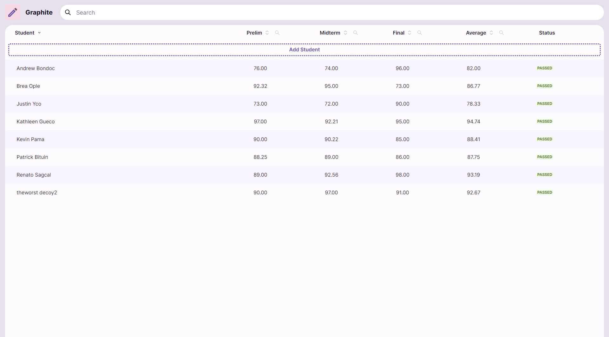

### Adding students
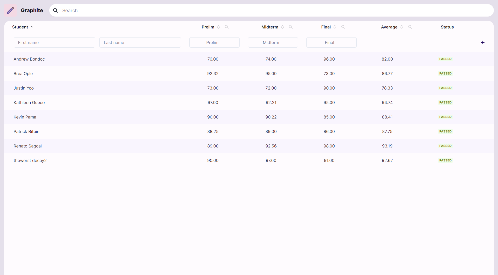
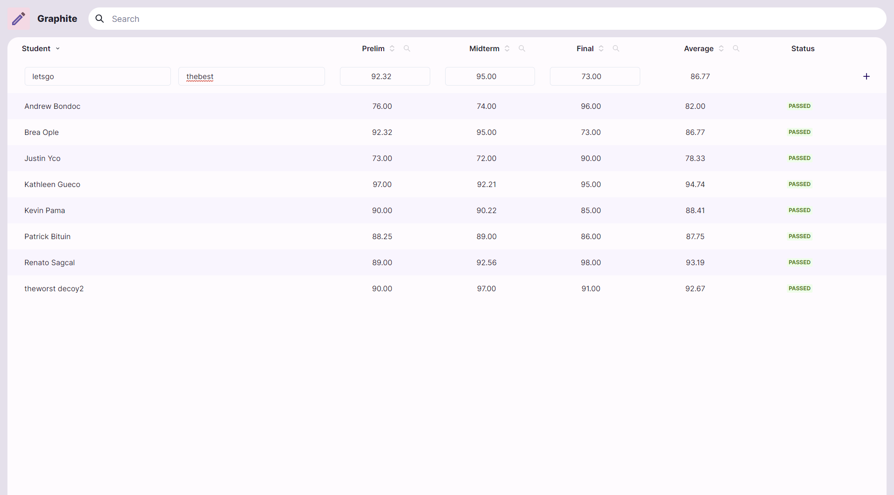
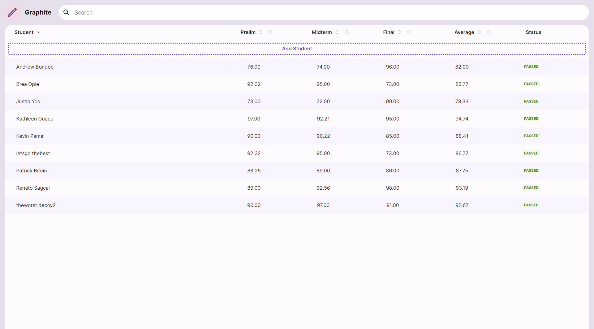

### Deleting students
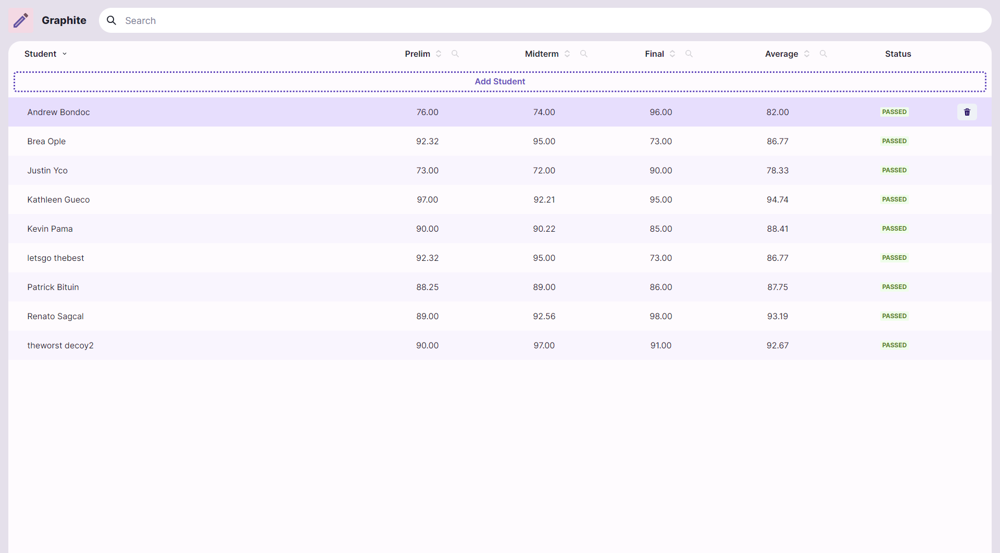
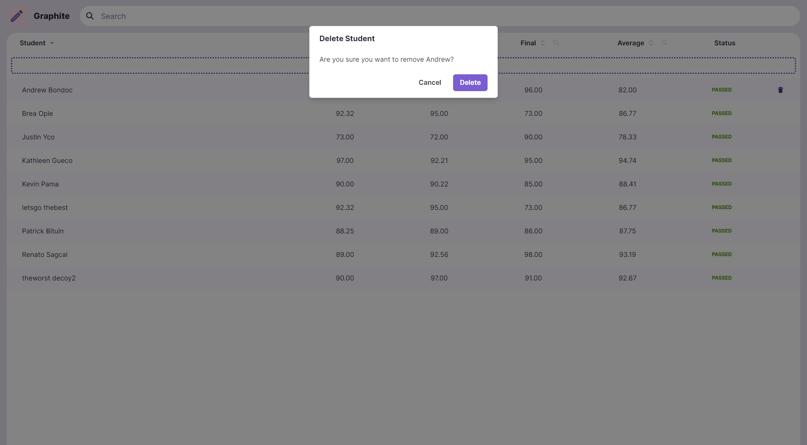
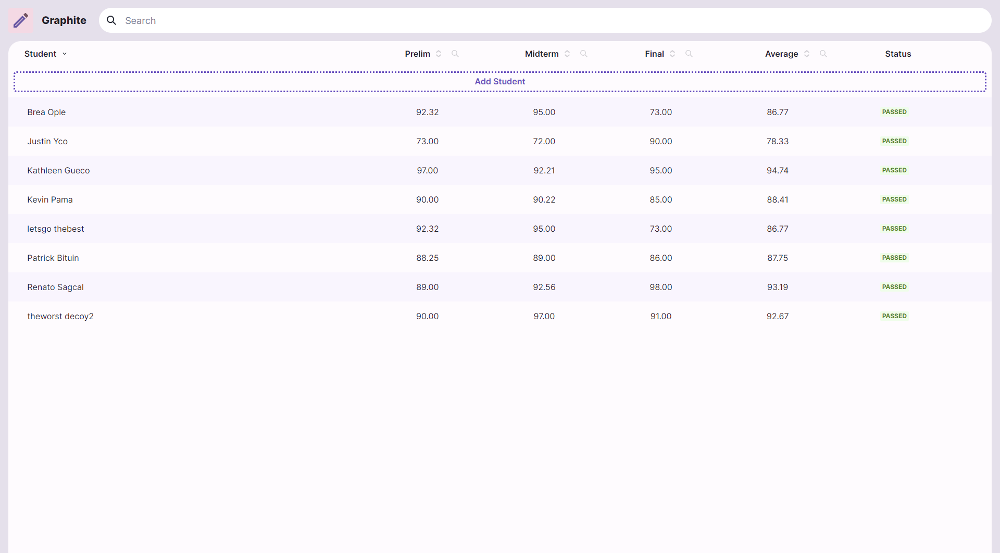

### Updating students
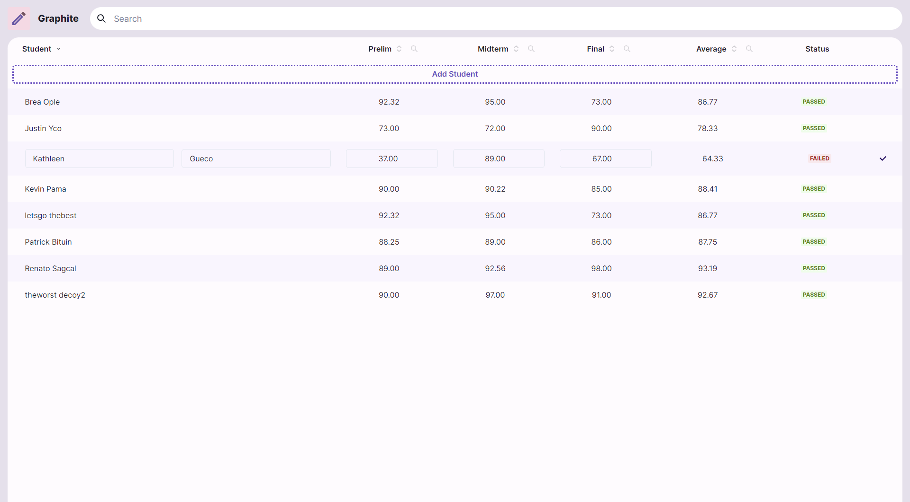
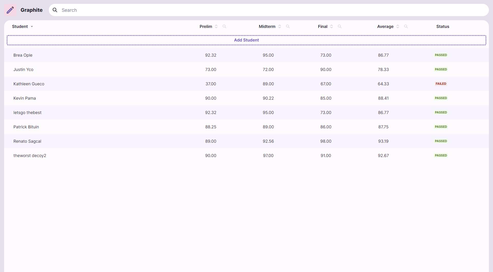

### Filtering by grades
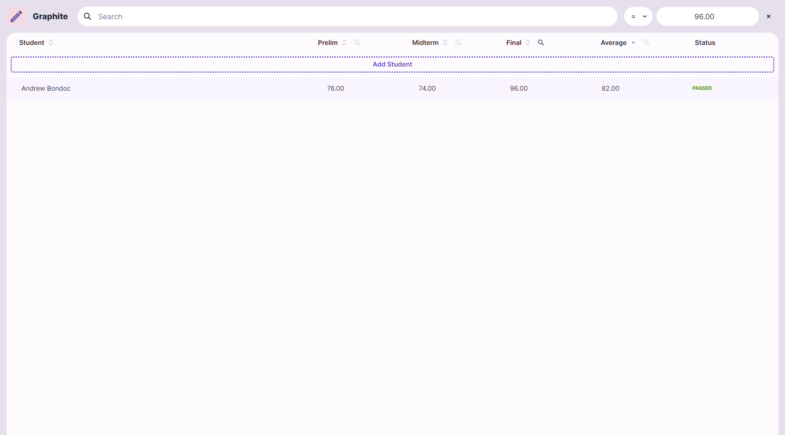
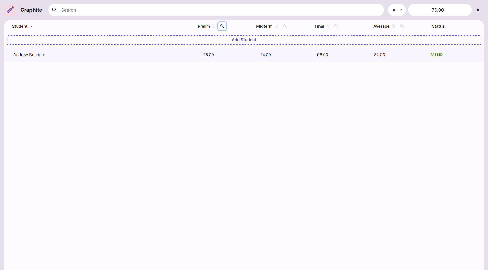
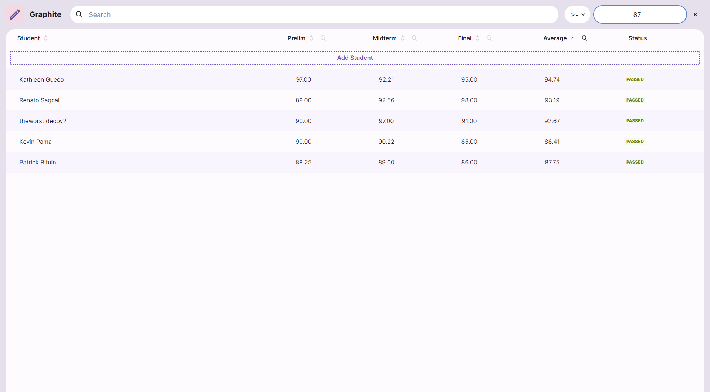

## Sorting
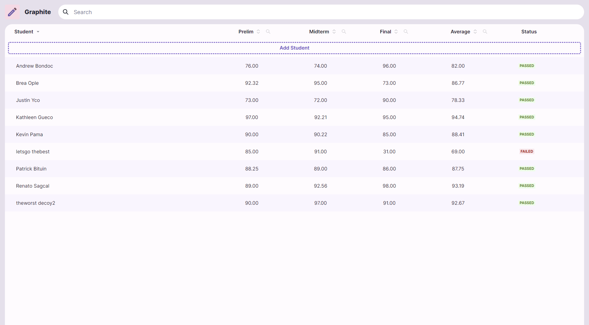
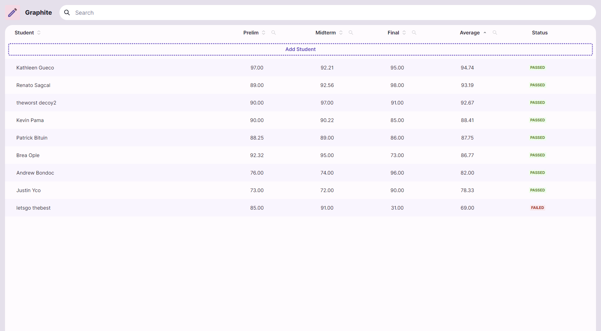